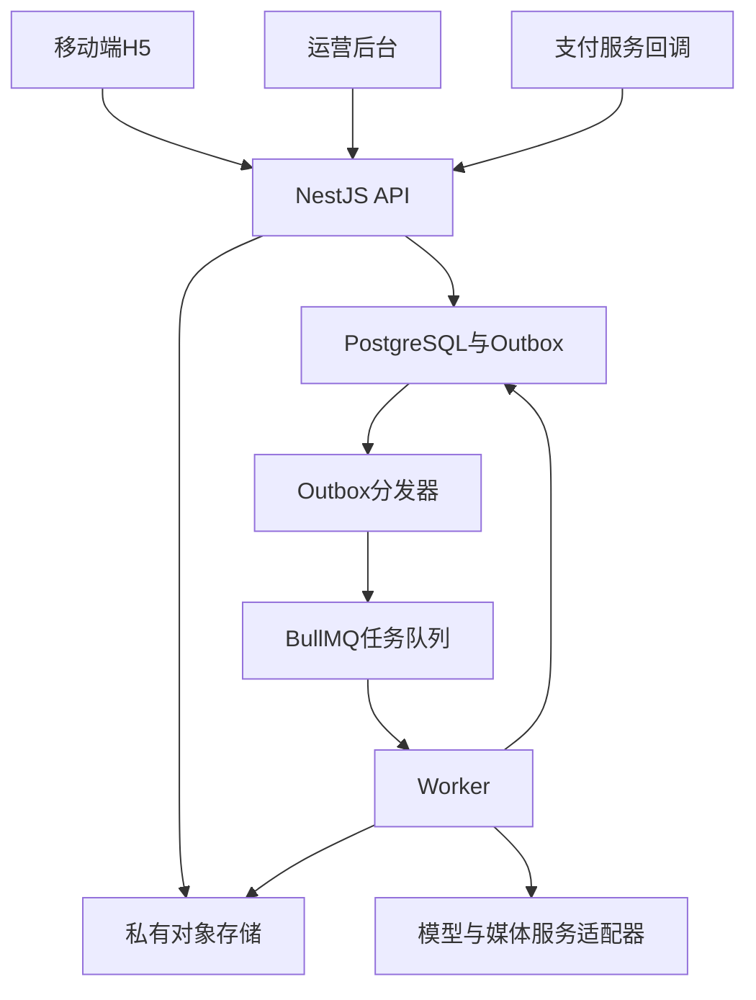

# 后端架构与业务逻辑

## 1. 建议架构

采用一个后端代码库和一套业务数据库，以模块化单体开始。API与Worker为同一版本的不同进程，不拆成十几个微服务。首发不训练人物专属大模型，不自建GPU集群。

阶段A可在同服务版本内运行轻量后台任务，但收费前必须补齐持久化任务与Outbox。队列只负责调度，业务状态仍以数据库为准。Redis或兼容服务暂不可用时，已收款事件保留在Outbox，不丢单。

## 2. 推荐代码边界

| 目录（计划） | 职责 |
|---|---|
| apps/client | uni-app用户端；V1只构建移动端H5，保留可迁移组件边界 |
| apps/admin | 独立运营后台；可从Vben一个应用裁剪 |
| apps/server | NestJS模块、HTTP API、鉴权、支付回调 |
| apps/worker | 复用业务服务，执行生成、转写、导出与对账 |
| packages/contracts | 与框架无关的DTO、枚举、接口客户端生成输入 |
| packages/domain | 金额、权益、状态机等纯逻辑 |
| packages/design-tokens | 跨端颜色、间距、字体规范 |
| infra | 数据库迁移、部署与恢复脚本（后续实现） |

工具链先分别验证再统一workspace：unibest当前packageManager与Vben不同，不能直接把两个完整monorepo套在一起。默认候选Node 24.x（至少满足所选包engines）；确定通过构建的补丁版本后固定。前后端不强行共用一份tsconfig或依赖版本。

## 3. 模块与责任

| 模块 | 输入与校验 | 产出/责任 |
|---|---|---|
| Auth | H5手机号验证码、可选H5平台身份绑定、已验证账号关联 | User、Identity、Session；V1不接小程序code，不在前端交换密钥 |
| Spaces | 当前账号、TA草稿、免费资格 | TA、成员、个人对话配置 |
| Memory | 内容、来源、可见范围、AI授权 | 条目版本、候选确认、检索索引 |
| Assets | 上传会话、字节数、归属与授权 | 私有对象、预检、转写、访问控制 |
| Chat | actor+TA、消息幂等键、已授权记忆 | 消息、生成运行、可恢复事件 |
| Commerce | 商品版本、报价、支付可信结果 | Order、Payment、Grant、Refund与流水 |
| Generation | 输入快照、规格、关联订单 | Task、Attempt、Work、交付状态 |
| Voice | 素材授权、质量检查、试听资格 | VoiceProfile、试听、激活与撤销 |
| Community | 用户确认的公开副本 | 审核版本、动态、举报、公开媒体 |
| Notifications | 任务事件/用户订阅 | 站内消息、平台通知；不绕过渠道授权 |
| DataRights | 当前范围、导出/删除请求 | 导出包、删除任务、撤权与审计 |
| Admin | 后台身份、最小权限、操作原因 | 工单处理、停售、审核、对账 |

## 4. 鉴权执行顺序

每个资源操作执行：验证会话 → 读取目标对象 → 校验TA有效成员关系 → 校验对象可见范围/所有者 → 校验所需权益 → 执行业务。禁止仅凭URL中的taId判断可访问；客户端不能提交actorUserId代替会话身份。

查询层必须带隔离条件；先读全部数据再在前端过滤不接受。后台RBAC与家庭成员角色不同；普通客服默认只看订单、任务状态和脱敏资料，查看素材需要工单关联和明确授权。

JWT若使用短期access token，refresh token必须轮换、可撤销且服务端保存hash；权限不永久写在token里。移除成员后每次API/媒体访问都重新确认成员有效性，不能等token自然到期。

## 5. 登录与跨端账号

V1 H5 使用同站点 HttpOnly 安全会话 Cookie 并做 CSRF 防护，首期以手机号验证码登录为主；如后续增加微信内 H5 OAuth，身份仍通过(provider, app_id, subject)建立唯一Identity，不能把身份信息当支付凭证。登录后恢复的returnTo只能是内部白名单路由，防止开放跳转。

V2 才接入小程序code、openid和平台短期令牌。小程序身份不能提前混入V1支付逻辑，也不能假定不同appId的openid相同。

## 6. 服务、事务与可靠性

- 一个数据库事务内写业务状态和Outbox事件；分发器重试投递，消费者按业务eventId去重。
- 数据库层设置唯一约束：支付交易号、(订单项,交付序号)、(用户,接口域,幂等键)、(对话,clientMessageId)。队列jobId不能替代数据库唯一约束。
- 持久化Task后再调用供应商；记录providerTaskId。超时不等于未提交，先查询再重试，防止重复成本。
- 领取任务使用租约与心跳，进程退出可重新领取；每次Attempt独立保存。重放只补缺失结果。
- 失败区分可重试网络故障、输入不合格、授权撤销、供应商拒绝和最终交付失败。退费不能由“前端超时”自动触发。
- 已售服务停售后仍能查单、交付或退款；暂停新报价不暂停历史订单售后。

BullMQ官方要求任务在重试时保持幂等；本方案额外用数据库流水保障业务一致性。[官方说明](https://docs.bullmq.io/patterns/idempotent-jobs)

## 7. 对外适配器

| 适配器 | 最小能力 |
|---|---|
| TextModel | generate/stream、取消尽力而为、usage、modelVersion |
| Embedding | embed、维度/modelId；不可混用不同模型向量 |
| ASR/TTS | 转写、合成、结果规格、用量与费用单位 |
| VoiceClone | 检查素材、试听、激活、查询、撤销/删除 |
| Image/Video | 预检、提交、查询、结果拉取、取消能力标志 |
| Payment | 报价后支付参数、验签解密、查单、关单、退款、查退款 |
| Storage | 受控上传、私有读取、删除、校验对象属性 |
| Push | 用户授权检查、发送、状态、不支持时退回站内消息 |

V1 只实现 wechat_h5 支付适配器，覆盖普通手机浏览器和微信内置浏览器的真实联调。H5 下单由服务端调用微信 H5 支付接口，传入服务端计算的金额、订单号、HTTPS回调地址、可信用户IP和H5场景信息，返回短期 h5Url；前端跳转后必须回到订单结果页查服务端状态。

Payment 适配器至少提供：创建H5预支付、验签解密支付/退款回调、按商户订单号或渠道交易号查单、关单、申请退款、查退款、申请交易账单和校验账单摘要。V2 再增加 wechat_mini_program，不改订单、权益和退款核心。供应商输出不直接作为前端长期链接保存，必须转存并检查结果。详细字段见[微信 H5 支付实施](11-wechat-h5-payment.md)。

## 8. 部署与运维建议

选择目标用户可稳定访问、满足业务主体要求的部署区域；首发用托管PostgreSQL与对象存储降低运维负担。API和Worker可先部署在同一台容器主机但分进程限资源；收费后数据库备份与应用机器分离。具体云厂商、规格和费用先压测再定，不把模板自带部署方式当最终架构。

环境分dev/staging/prod；支付、模型、存储分账号或命名空间隔离。密钥只在服务端密钥管理中注入；日志默认只含traceId、业务ID、状态、时延和脱敏错误。部署采用先向前兼容迁移、后发应用的顺序。

PostgreSQL事务是最终账本；缓存失效不得把过期权益变为有效。媒体访问短时有效；缓存不能绕过授权。备份恢复后先重放删除墓碑，再开放应用，避免已删数据重新可见。

初始内部目标：核心元数据API p95小于500ms（不含模型/上传）；50并发会话试压无越权和重复交付。以上是验收目标，不是已测结果。模型首字、总时长分别监控，不向用户承诺无依据的固定完成秒数。
