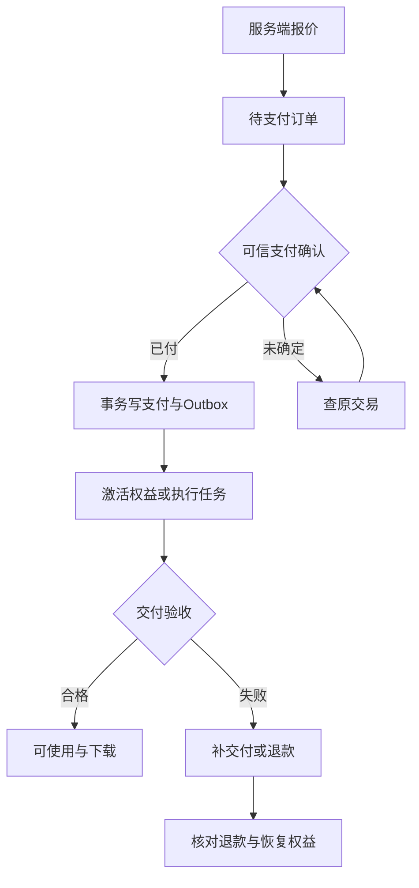

# 交易、权益与售后状态机

价格基线见[总纲](01-product-and-scope.md)。本文件的售后是拟采用的商业承诺，不代表已经发布的正式条款。结算页展示当次条款版本，不能静默改动已售订单。

## 1. 四种状态不能混为一谈

| 对象 | 状态 | 事实来源 |
|---|---|---|
| Order | pending_payment/paid/cancelled/closed | 本地订单与可信支付事件 |
| Payment | created/pending/succeeded/failed | 支付渠道回调或主动查单 |
| Fulfillment | pending/activating/processing/delivered/failed | 权益激活或作品交付检查 |
| Refund | requested/reviewing/approved/processing/succeeded/rejected/failed | 售后决策与渠道退款结果 |

退款是独立对象；已支付事实不从数据库抹掉。订单展示状态由以上状态组合生成，如“已付款，作品处理中”“退款处理中”。前端跳转返回只触发查单，不能自行写paid。

## 2. 报价规则

输入为商品版本、购买账号、目标TA/独立作品、输入素材版本、操作类型new/renew/upgrade和可用抵扣。后端检查商品可售、渠道支持、TA归属、素材预检、声音试听与授权、会员价资格，再出快照。

会员价只用于有效付费TA关联的影像；首发建议仅该空间购买账号享受，家人协作者不自动继承购物折扣，避免用他人会员购买无关作品。此为实施细化，需价格页明确。声音年费和留声包必须绑定同一TA与本人音色；独立影像可不建TA。

报价10分钟有效（配置建议）；修改素材、动作、商品或TA后旧报价失效。创建订单事务消费quote并预留抵扣，pending订单30分钟到期（V1.1开发默认；Stripe Session有效期从创建时起30分钟，订单到期时间须同步；创建外部会话前若报价已失效则重新报价），到期先向渠道核对/关单再释放抵扣。仅本地计时超时不能断言未收款。

第二位TA先draft；年费购买成功再激活。若已占免费名额且只想做独立影像，允许按普通价购买而不建立新空间。已有有效记忆会员购买声音用upgrade，不重复收两个完整年费。

## 3. 微信 H5 支付（V1）

首期仍只做移动端 H5。支付按实际商户资格和容器选择：微信外浏览器用 wechat_h5，微信内网页用 wechat_jsapi；已有受支持地区且获准收款的 Stripe 账号时可启用 stripe_checkout。所有通道默认关闭，完成对应验收才发布。JSAPI 网页支付不是小程序开发；小程序 code 登录与 wx.requestPayment 留到 V2。通道选择及资格见[支付路由与 Stripe](16-payment-routing-and-stripe.md)。

本节余下微信字段只适用于直连微信适配器；Stripe 的 Session、Webhook 和退款映射见16，不能套用微信签名/解密。

服务端 H5 下单使用订单快照，不能接受前端金额。请求至少包含：

- 商户侧 appid、mchid；
- description、out_trade_no、time_expire；
- HTTPS 且无查询串的 notify_url；
- amount.total 与 CNY 币种；
- scene_info.payer_client_ip；
- scene_info.h5_info 的场景类型、应用名和应用URL。

微信返回 h5_url 后，前端跳转支付页。支付页返回地址只用于恢复订单页面，不能作为支付成功凭证。支付结果页请求 GET /orders/{id}；支付处理中时按频率限制主动查单，不能重复创建业务订单。

用户真实IP只能从受信任的反向代理头解析；不能把 Cloudflare/Nginx 的代理IP直接传给微信。服务端统一生成 notify_url、time_expire 和 returnContext，不允许客户端提交任意跳转地址。

### 微信支付状态映射

| 微信原始状态 | 本地处理 |
|---|---|
| SUCCESS | Payment=succeeded；事务内写Order=paid、Outbox和权益 |
| USERPAYING | Payment=pending；继续查单 |
| NOTPAY | Payment=pending；到期后先查单再关单 |
| CLOSED | 订单关闭，不发权益 |
| PAYERROR | 支付失败，允许重新支付 |
| REFUND | Payment仍保留已支付事实，单独更新Refund |

本地必须保存 provider trade state、微信交易号、商户订单号、成功时间、支付金额和脱敏的渠道状态；不能只保存一个 boolean paid。

### 回调处理

回调端点不需要用户会话。必须读取原始请求体和微信签名请求头，先验签，再用 APIv3 密钥解密资源，校验商户号、appid、订单号、币种、金额和渠道交易号。

事务顺序：

锁 Order → 去重 event_id/trade_no → 校验金额 → 写 Payment → 写 Order → 写 Outbox → 提交 → 返回200。

数据库或业务处理失败返回4xx/5xx；验签失败不能开通权益；耗时的生成、发通知和媒体处理走Outbox/Worker。重复回调只产生一次支付事实。

### 查询与关单

本地订单到期前后都不能只依赖本地计时器判断未支付。先按商户订单号或渠道交易号查单；确认未支付且已达到 time_expire 后，再调用微信关单。查单超时进入 PAYMENT_PENDING，不能自动重买。

### 退款

退款是独立对象。申请退款时生成唯一 provider refund no，锁订单并校验累计退款金额；退款接口超时先查退款，不能再次提交同一退款号。退款回调或查退款确认成功后，才撤销对应 grant、恢复可抵扣权益并通知用户。

退款记录至少包含 requestFen、providerRefundNo、providerRefundId、providerStatus、refundSuccessTime 和累计退款金额。支付成功、退款处理中、退款成功不能混成一个状态。

### 账单和对账

首发收费前必须实现或至少安排人工可执行的微信交易账单核对：

1. 申请交易账单；
2. 获得下载地址和账单摘要；
3. 下载文件并校验摘要；
4. 按 out_trade_no、transaction_id 比对本地订单、退款和权益；
5. 记录渠道已付本地未付、本地已付未交付、退款未确认和金额差异；
6. 后台生成可追踪的对账运行和差异工单。

详细字段和上线清单见[微信 H5 支付实施](11-wechat-h5-payment.md)。

## 4. 权益发放

记忆权益作用于TA；声音使用权作用于TA+购买User；容量、协作与个人声音拆成grant。消费者以(orderItemId,grantType)唯一发放，重试只读回已有grant。

首次记忆年费从激活成功时开始365天。首次声音付款后如供应商需额外激活，先显示activating；激活完成统一启动其声音及包含的记忆权益，不能消耗等待天数。失败进入补交付/退款，老记忆权益在升级激活完成前继续有效。

同档续费：仍有效则从原到期日顺延365天，已过期从成功开通日起算。续费不重新收首次音色费。个人声音grant不会因家庭邀请复制。所有自动续费开关默认不存在，采用手动续费。

## 5. 升级与抵扣精确口径

系统金额以分计算。建议剩余价值按剩余秒数/原服务总秒数计算，到分四舍五入；UI展示剩余日期和实际抵扣，避免“按天”和实际按秒计算互相矛盾。

`unusedFen = round(originalPaidFen × remainingSeconds ÷ originalDurationSeconds)`

上限不超过原套餐可抵扣余额；已经退款或被其他升级消费的价值不可再用。示例刚好剩183整天：`9900×183/365=4963.56`，四舍五入4964分；新声音年费29900分，实付24936分。新365天从升级激活时开始，原记忆grant被替换。

留声包购买后30天内升级同TA声音年费，可抵扣该包实际支付金额，最多1份；最多抵扣应付金额。与旧年费剩余抵扣可以并存，各自记录来源。已退款、已抵扣或非本人同TA包不可用。

创建upgrade订单时锁来源grant与credit，预留价值；支付激活事务最终消费。两个窗口同时下单只能有一个有效预留。若渠道晚到成功但来源已不适用，不擅自加收或缩减权益，进入核对并给出补救或退款。

## 6. 作品交付与计数

- 影像付款后由订单Outbox自动建任务，用户关闭页面也继续。前端没有“自报支付成功后免费调用生成”的接口。
- 场景4张必须交付4张通过格式和质量检查的图。部分完成只补缺失索引，不重复覆盖可用结果；规格不符不标delivered。
- 留声包固定slot 1/2/3，生成前预留slot，成功交付才消费；失败释放，返工复用该slot。新文本主动创作属于新slot/新订单，技术失败重试不收费。
- 生成结果先转存且能访问，再写delivered。供应商URL可打开一次不等于用户拿到可长期找回的作品。
- 预检不能保证最终效果；明显变脸、缺失人物、文件不可播放等进入返工/售后。取消仅在确实可取消的阶段提供。

## 7. 售后规则与退款一致性

建议首次年费购买7天内不合适可申请退款，不扣首次音色费，不强迫降档；声音7天内可免费修正一次，但用户不必先接受修正才允许申请体验退款。首次7天从成功激活计，激活前未交付另按交付失败处理。

作品技术失败先自动重试，最终未交付退实付；规格明显不符可7天内申请一次免费返工，仍不符退款。建议2个工作日内给处理结果，到账时间依据渠道反馈展示。是否达到客服承诺能力必须在开售前验证。

退款事务分两段：

1. 批准退款时锁订单，验证退款累计额、抵扣来源和交付状态；写refund批准+Outbox，冻结该待退新增生成资格，防止退款过程中继续新消费。保留旧内容访问。
2. 以稳定refundNo调用渠道；超时先查退款，不再建退款号。确认成功后写退款流水、撤销对应grant、恢复升级前剩余权益，通知用户。渠道失败保持可追踪重试，不谎报到账。

升级退款退本次实付，恢复升级时被抵扣的原套餐剩余价值。建议恢复为“原快照剩余秒数减去升级期间已经经过的秒数”，最低0，避免延长两份服务；这是对原方案未明确定义处的实施建议，需条款确认。来源留声包的抵扣标记恢复，但原包已消费slot不复原、不再次退已发生的原单实付，具体退原包走它自己的订单。

退款后不能删除用户原始记忆或已合法下载的作品。局部退费与部分交付若首发不支持自动处理，明确转人工，禁止按总金额随意扣grant。

## 8. 到期和容量

到期关闭新语音生成、高级整理、新邀请及高级协作；基础文字、旧内容读取和导出继续。现有成员可读已有家庭素材，但不再新增协作写入。基础20条参与检索的选择规则见数据模型。

容量回到500MB加仍有效扩容；超出时暂停新增保存，不立即删除。扩容有独立365天期限，到期同样只影响新增容量。服务是否可调用每次由后端按服务器时间判定，不只靠每日cron更新状态。

提交语音时权益有效且任务已受理，到期后允许该已受理任务完成；下一条需要有效权益。撤销声音授权比套餐有效期优先，未完成输出不再释放。

## 9. 必测交易案例

重复回调10次只开一次；H5支付成功后关闭网页仍可查单并交付；支付跳转返回不直接改paid；查单成功与回调同时到达不重复；真实IP缺失拒绝下单；金额被篡改拒绝；H5链接失效不重复建业务订单；订单到期先查单再关单；退款接口超时后能查回；退款通知重复不重复撤销权益；账单摘要校验失败告警；套餐过期边界正确；支付晚到不吞款；声音激活失败不损失旧年费；容量满仍可下载作品和导出。

> V1.1实施对齐（2026-09-19）：首发范围与开发默认值见[17](17-v1-contract-completion.md)，支付见[16](16-payment-routing-and-stripe.md)，后台见[18](18-admin-api-and-operations.md)，AI落地见[19](19-ai-provider-and-evaluation.md)，验收见[20](20-acceptance-matrix.md)。A/B接口以[12](12-openapi.yaml)为准；新增数据库定义见[补充迁移](../infra/migrations/0002_v1_gaps.sql)。C/D仍按阶段评审。
