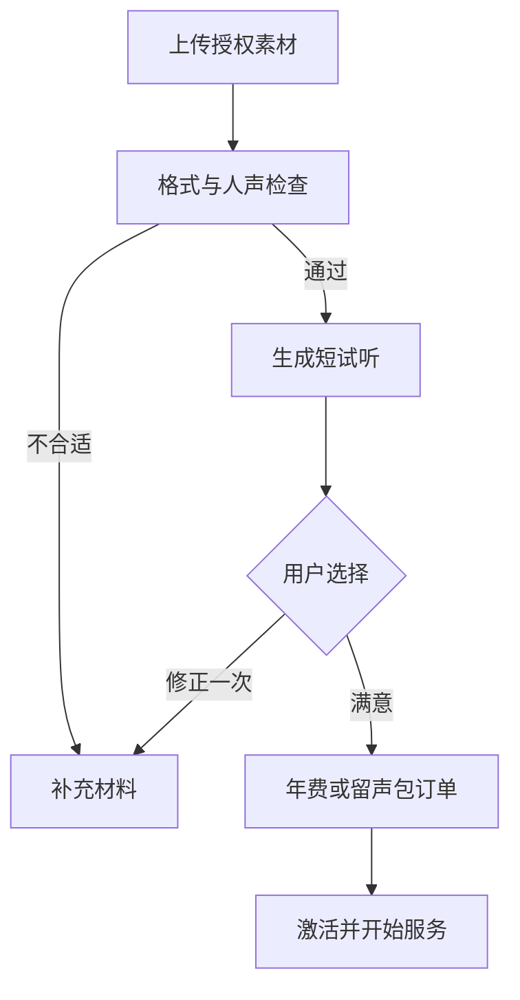

# AI、记忆、声音与影像管线

## 1. 首发模型策略

文本、转写、声音和影像通过独立服务端适配器接入。先测试国内用户真实素材上的效果、时延、成本和失败率，再选择供应商；本稿不把某个API的公开演示当作萤火已具备的能力。

开源候选GPT-SoVITS、Real-ESRGAN用于后续自部署评估。首发采用托管API可降低GPU运维负担，但必须记录服务区域、素材保留规则、声音ID寿命和删除接口，验证授权撤销可落实。不要仅比较单次推理报价。

## 2. 文字对话

处理顺序：会话与TA权限 → 幂等保存用户消息 → 获取本人偏好和共享人物资料 → 检索已授权记忆 → 组织提示 → 调用模型 → 持久化助手消息 → 发布事件。模型无法直接访问订单、其他TA或其他成员私聊。

提示层分三段：固定行为规则、结构化人物与记忆资料、当前对话。上传资料/检索结果属于不可信内容，不能覆盖固定规则或授予工具权限。首发聊天不开放任意网页、shell或数据库工具调用。

明确要求：资料不足时不编造亲历事件；不把AI当真实本人；用用户选择的称呼和自然简短表达；只有真实提供的口头禅才能作为人物习惯。用户说“你记错了”时提供更正入口，但新事实需用户确认保存。

处理自伤等高风险表达时采用经过测试的支持性响应，不能模拟亲人要求伤害自己、付款或与现实关系隔离。保留暂停/返回文字入口；不把产品宣传为医疗或心理治疗服务。

## 3. 记忆策略

阶段A先用少量确认事实、人物字段与近期对话。基础20条可直接按权限取出并在token预算内整理，不必为第一版先搭复杂Agent记忆框架。

记忆规模增长后引入pgvector：用户确认的memory版本 → 分块 → embedding → 同库检索。按profileId、成员关系、private owner、useForAi、当前版本与删除状态过滤，在SQL查询中完成；不能先跨空间取topK再“希望模型别说出来”。pgvector支持把向量和关系数据放在PostgreSQL中，具体索引策略需按数据量验证。[仓库说明](https://github.com/pgvector/pgvector)

资料被更正或撤销授权时：先更新权威版本与可用标志 → 递增空间/账号记忆revision → 禁止旧索引参与查询 → 异步重建索引并清理旧块。生成前记录revision，输出前复核；若处理中撤权，停止发布依赖失效资料的新结果。删除旧索引任务失败也不能让旧资料再次可检索。

聊天候选记忆只存pending，不把助手猜测自动写成事实。确认时允许修改文字和可见范围。来源、版本和检索ID保留在内部排障元数据，用户聊天页不展示检索卡；用户从记忆库核对。

初始建议预算：近期对话最多20轮并按token裁剪；长期事实最多8条相关片段，每段长度受限。超预算优先选当前相关、用户确认、最近更正的事实，不盲目塞全部相册。数值为调试起点，须以效果评测调整。

## 4. 图片进入对话

上传图片默认仅当前私聊可见。具备视觉模型且用户授权时可分析图片，识别描述属于AI生成，不能仅凭照片推断人物身份、关系或家庭事件为事实。未接视觉模型时如实提供“保存照片并补充说明”，不伪造看图回复。

## 5. 声音试听与服务

建议采集30–60秒清楚单人自然录音，最终要求由所选API决定。多人重叠、强音乐、极低清晰度先说明原因；方言不一刀切拒绝，以真实试听能否达到交付标准判断。不要先卖“保证像本人”。

免费试听每账号同TA首轮1次、材料修正1次，事务记录；这限制的是售前试制资源，不是已付费聊天次数。试听成本要计入获客；已失败未产出不按合格试听消耗，反刷可人工核实。

音色状态：material_checking → trial_building → trial_ready → activating → active；可进入rejected/failed/revoked/deleting。trial_ready不代表永久可激活：供应商试听音色若会过期，结算前确认可用，过期须重新试听；不将providerVoiceId暴露给用户直接调用。

年费语音消息链：录音 → ASR → 用户可查看转写 → 文字模型 → 当前有效音色TTS → 私有转存 → 音频气泡。ASR失败允许重录/改文字；TTS失败仍保留已生成文字并重试该音频，不重复生成整段回复。不是来电界面，不承诺实时双向通话。

到期旧音频可回放；授权撤销禁止新合成。固定留声作品输入文本最长200汉字的规则需统一字符统计方法；建议按Unicode字素计数、所有可见字符均占上限，避免英文/表情绕过成本边界，正式页面写“最多200字”。这属于实施细化，发布前与产品确认。

## 6. 影像异步任务

通用状态：queued → preflight → submitted → processing → verifying → succeeded；网络重试retry_wait、供应商状态未知reconciling、部分成功partial、最终failed、授权取消cancelled。每次提交独立Attempt，不能把网络超时直接当最终失败退款。

输入快照包含素材版本、授权、目标人物、场景/动作、商品规格。Worker只处理白名单可访问的私有对象，不抓任意用户URL；获取供应商结果时限制域、大小、重定向和内部地址，避免服务端请求滥用。

输出检查：张数/时长、格式、分辨率、可解码、可下载、人物明显缺失或畸变、生成标识。自动检查覆盖不了主观相似度，首轮应人工抽查并保留用户返工入口。原图始终保留，增强结果不能声称恢复从未记录的真实细节。

4张场景按索引交付，失败补对应索引；动态6秒、768P属于拟规格，候选模型无法稳定达标就先不售。供应商结果转存完成前任务不能标成功。

## 7. 费用账本与开售门槛

每个Attempt记录模型、调用类型、输入/输出计费量、计费单位、单价版本、估算费和实账费；失败重试同样计费。汉字、字符、token、秒不能混算。缓存只复用同用户同授权范围内已有音频，不用公开跨用户缓存泄露相同文本或音色。

供应商费用以正式签约/控制台账单核对；上一份价格文档中的示例不是本次锁定采购价。99元年费目标平均交付成本≤39.6元、299元≤119.6元是60%贡献率的内部测算门槛，尚未计固定研发和全部获客，不是利润保证。

声音开售至少看普通与高频正常用户的连续使用分布、试听失败、免费修正、ASR/TTS、存储/流量、客服和退款。若不达标，先只卖能稳定交付的留声作品，或开售前公开调整方案；不得对已经买下的正常用户偷偷加分钟上限。

## 8. 测试集

先用合成/明确授权的测试资料，至少覆盖：无照片人物、资料不足、同名不同TA、家庭共享与私聊、记忆冲突与更正、撤权后检索、口音和杂音、只有背景声、多人声、人物缺失、供应商慢响应、重复任务、退款后回调晚到。

每个文本候选模型对同一批30–50个用例评估：事实一致、称呼一致、自然度、未知处理、隐私边界、时延和成本。隐私越权与严重捏造不是可由平均分抵消的问题，出现即阻塞上线。声音/影像用盲测与任务成功记录，不把供应商宣传指标抄作验收结果。
